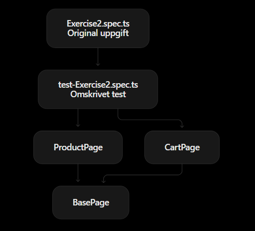
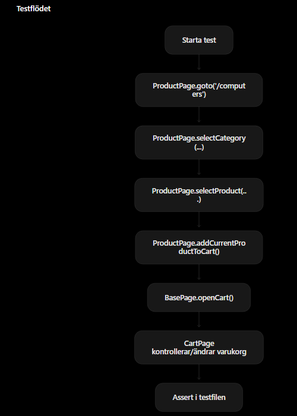

# L3

`BasePage.ts` är grundklassen som innehåller gemensam funktionalitet som flera sidor behöver, till exempel att öppna sidan, välja kategori och öppna varukorgen.

`ProductPage.ts` hanterar produktflödet, alltså att öppna en produkt och lägga den i varukorgen.

`CartPage.ts` hanterar varukorgen, till exempel att kontrollera antal, ändra antal och ta bort produkter.

`Exercise2.spec.ts` är själva testfilen som använder `ProductPage` och `CartPage` för att köra testscenarierna på ett mer lättläst sätt.
I orginalet så är allt innuti denna, men givetvis så är inte fallet i vår lösning eftersom vi använt page object model (URL:https://playwright.dev/docs/pom).

`Exercise2.spec.ts` använder sig av `ProductPage.ts` och `CartPage.ts` som båda ärver från grundklassen `BasePage.ts`

